# CourseProject_Bullet_2024
# Modelling the Bullet at Mach 1 🧨💨
CFD simulation of airflow around a bullet traveling at Mach 1 using **OpenFOAM**.  
The project focuses on shockwave formation, mesh dependence, and convergence behaviour  
for compressible Euler flow.

Author: **Suvaan Borbaana**  
Date: December 19, 2024

---

## 📘 Problem Description

The goal of the project is to model the airflow around a bullet moving at **Mach 1**  
and study the resulting **shockwaves**, **flow separation**, and **numerical effects**  
introduced by different mesh resolutions.

Shadowgraph example of a bullet shockwave (MIT, Harold Edgerton):  
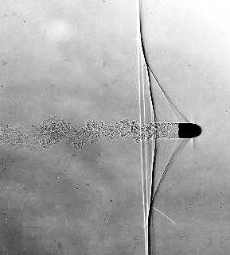

---

## 🧮 Governing Equations

The simulation solves the **Euler equations** for inviscid compressible flow:

### **Euler Equations:**

$$
\frac{\partial \rho}{\partial t}
\;+\;
\nabla \cdot (\rho \vec{u})
= 0
$$

$$
\frac{\partial (\rho \vec{u})}{\partial t}
\;+\;
\nabla \cdot (\rho \vec{u} \otimes \vec{u} + p \mathbf{I})
= 0
$$

$$
\frac{\partial (\rho E)}{\partial t}
\;+\;
\nabla \cdot \left( \left( E + \frac{p}{\rho} \right) \rho \vec{u} \right)
= 0
$$

## 🧱 Boundary Conditions

| Boundary        | Condition for **U** | Condition for **p, T** |
|-----------------|---------------------|-------------------------|
| Top             | `zeroGradient`      | `zeroGradient`          |
| Bottom          | `slip`              | `zeroGradient`          |
| Bullet surface  | `slip`              | `zeroGradient`          |
| Inlet           | `fixedValue`        | `fixedValue`            |
| Outlet          | `zeroGradient`      | `zeroGradient`          |

---

## 🕸 Mesh

A structured mesh was used for the bullet domain.

The mesh quality directly impacts numerical viscosity and the visibility of  
vortex structures forming behind the bullet.

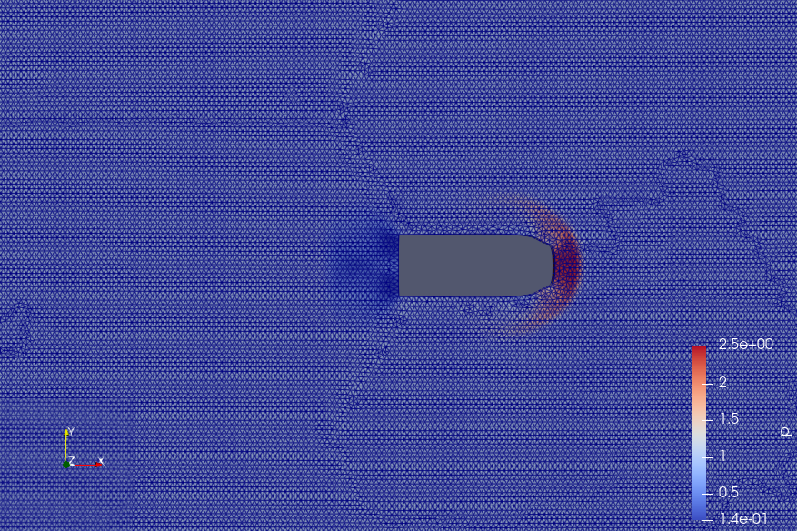

---

## 📷 Shadowgraph Visualization

Shadowgraph snapshots were taken at **0.6 seconds** and **2.7 seconds**,  
highlighting shockwave formation and evolution.

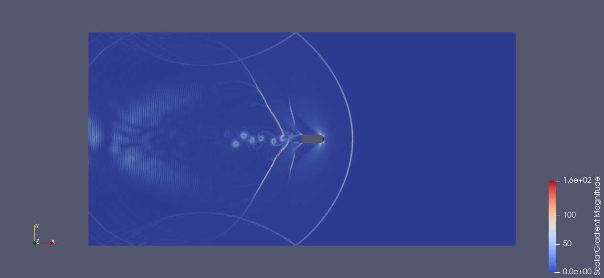
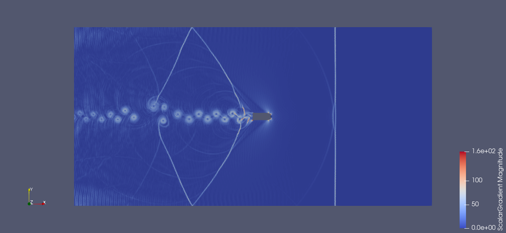

---

## 🌪 Mesh Resolution Study

To illustrate the effect of numerical viscosity, the simulation was run at  
different mesh densities:

- **100 cells per unit height**
- **200 cells**
- **300 cells**
- **400 cells**

Higher resolution yields sharper shock fronts and clearer vortex structures.

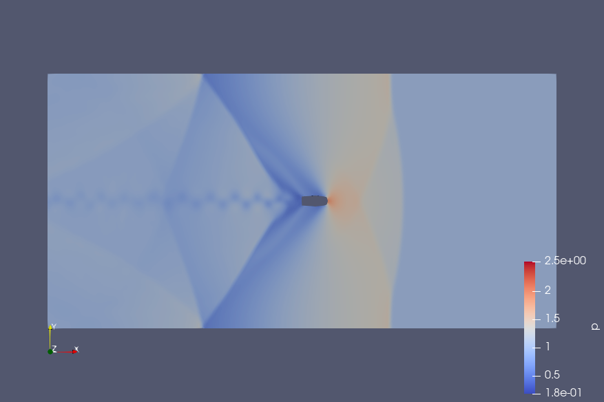
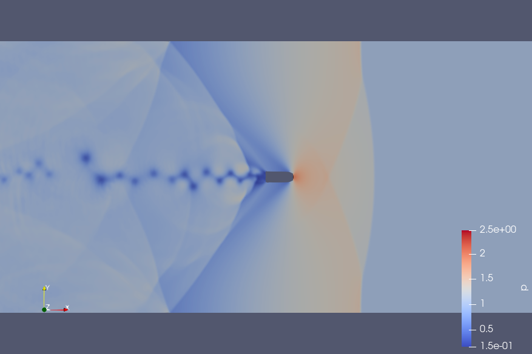
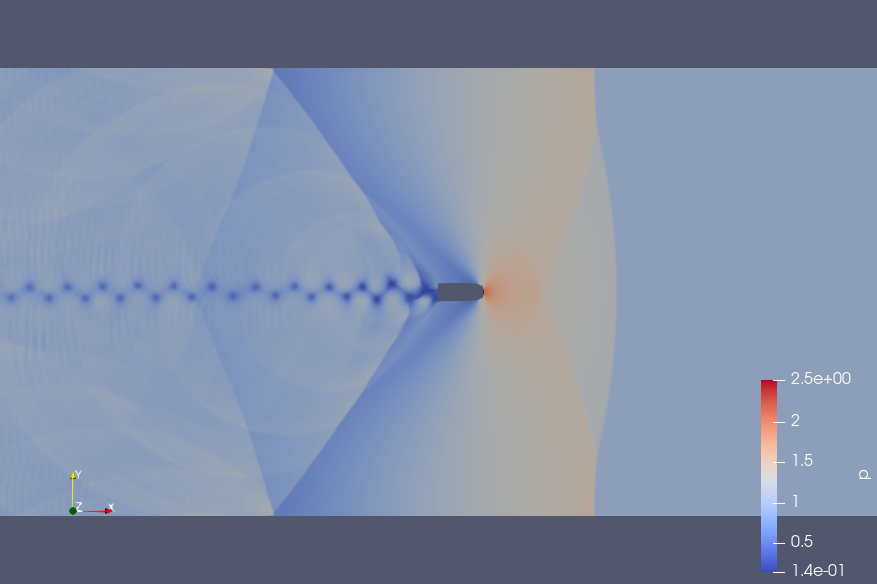
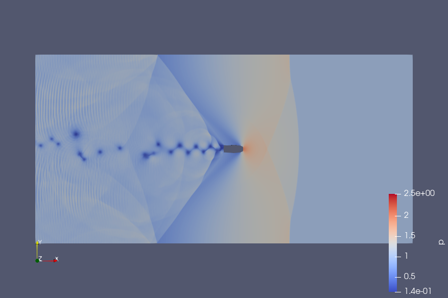

---

## 📊 Convergence Analysis

Comparison of **pressure** and **density** at a horizontal slice (`y = 0.7`)  
for different mesh resolutions at **t = 2.7 seconds**.

Key result:
- Increasing mesh density improves solution accuracy and reduces smearing.
- 400 cells-per-height simulation required **14 hours of CPU time** for 5 seconds of physical time.

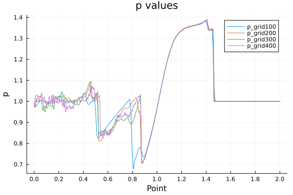
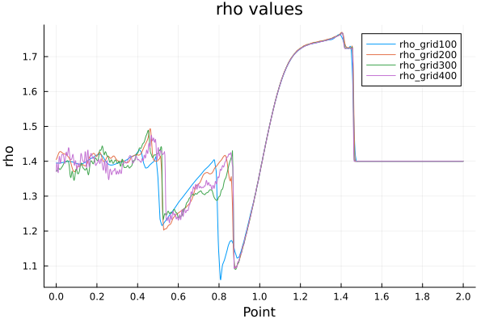

---

## 📐 Norm-Based Error Metrics

L1 and L2 norms were computed for line slices to quantify convergence and mesh dependence.

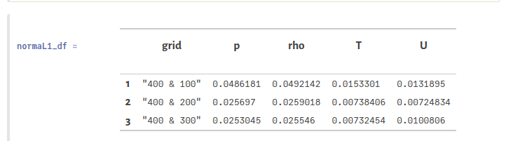

---

## 🛠 Tools & Methods

- **OpenFOAM** (compressible solvers)
- Euler equations for inviscid flow
- Shadowgraph visualization
- Mesh refinement techniques
- Timestep control for stability

---

## ✅ Project Summary

This project demonstrates:

- Formation of a **bow shock** around a Mach 1 bullet  
- Influence of **mesh resolution** on numerical dissipation  
- Strong effect of numerical viscosity on vortex formation  
- Importance of convergence analysis in CFD  
- Practical experience with OpenFOAM for high-speed compressible flows  

---

## 📄 Cite or Reference

This project is based on course work at the  
**Open Source Modeling course — Skoltech, 2024**,  
under supervision from **Prof. A. Kasimov** and **Dr. O. Rogozin**.

